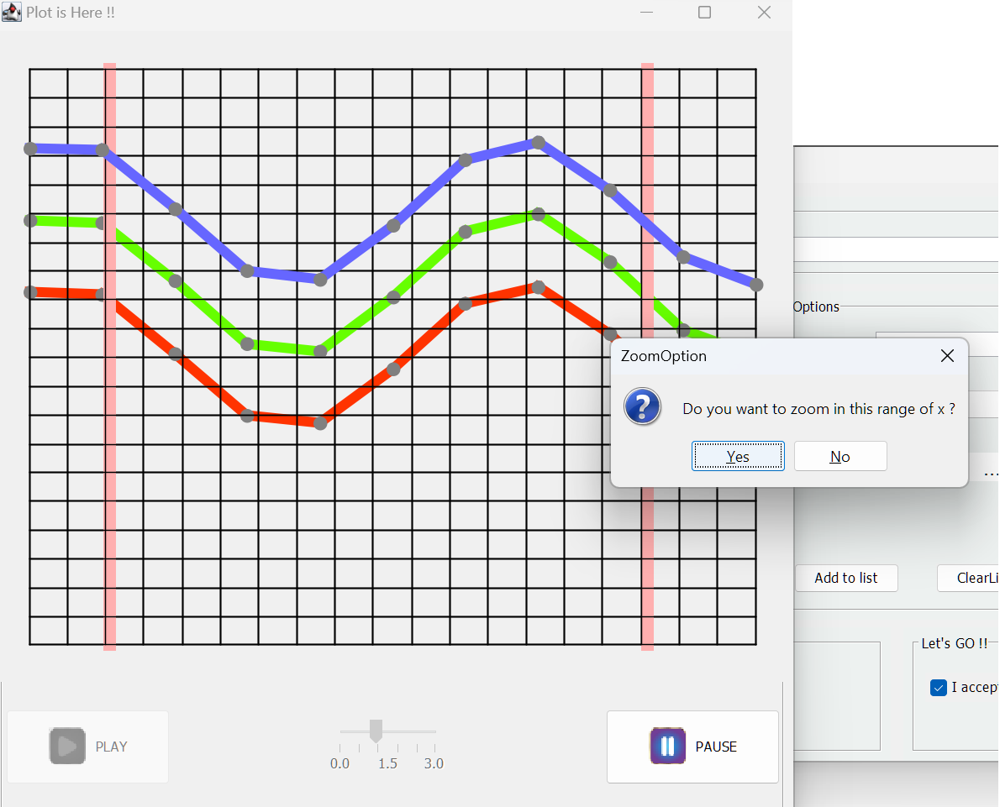

# Visualization of Mathematical Expressions Over Time and with Different Parameter
Here is an example result of the visualization of a given expression with parameters x, c (color), and t (time) within a specified interval:

# How to use
* First, you should write a valid mathematical expression, including any function from the calc/expressions classes (which include approximately 35 functions). An example expression could be "mul(add(sin(x,t)),c)."

* Next, determine the intervals for the mentioned parameters that you want to display on the screen, along with the desired accuracy for expression calculations.

- You can see your plot moving on the time interval you have entered in the different c-values(colors) you've chosen.

PS: You can zoom on an specefic interval interactivly, study the plot values by moving the cursor, save and load current plot configuration.

